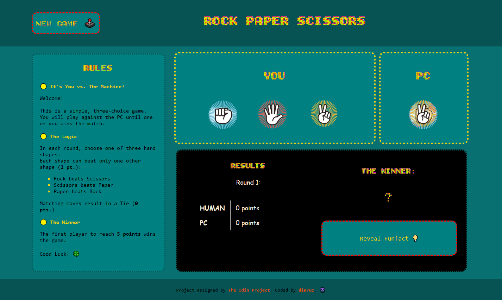
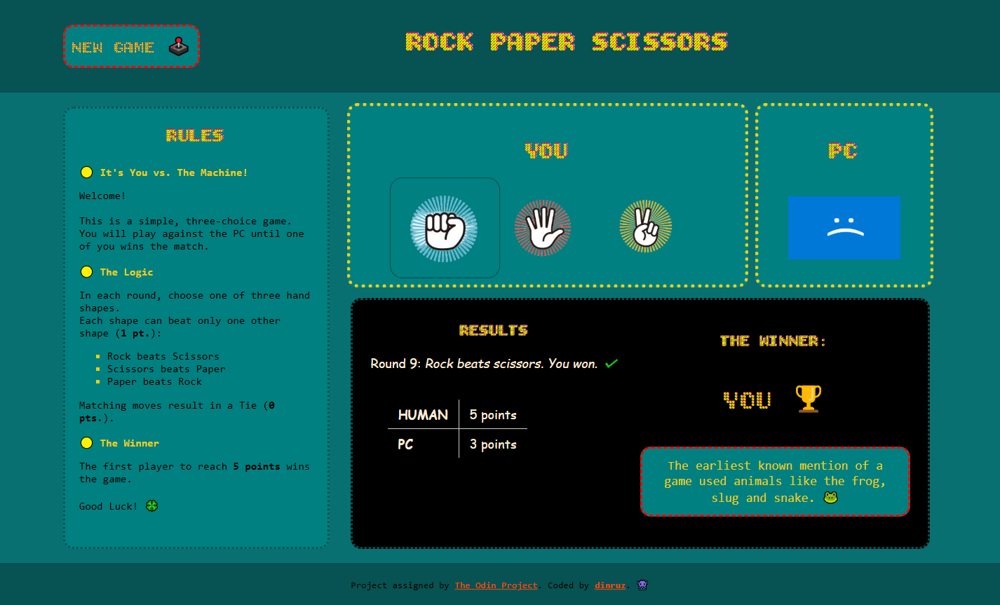

# 'Rock Paper Scissors' Project

This repository contains the solution for "Rock-Paper-Scissors" project from The Odin Project.

## Table of contents

- [Overview](#overview)
  - [Phase 1 - Console Logic](#phase-1-console-logic)
  - [Phase 2 - UI Implementation](#phase-2-ui-implementation)
- [Links](#links)
- [Screenshots](#screenshots)
- [Technical Details](#technical-details)
  - [Built with](#built-with)
  - [How to Play](#how-to-play)
- [Development Timeline](#development-timeline)
- [Credits](#credits)

## Overview

This project was assigned by [The Odin Project](https://www.theodinproject.com/), as part of Foundations Curse. 
It's developed in two phases, demonstrating a progression from fundamental logic to advanced DOM manipulation.

### Phase 1: Console Logic 

* Implemented core **game logic** (win/loss conditions).

* Used **`if/else`** statements and a **`for` loop** to control the game flow.

* Handled **random computer selections** using `Math.random()`.

### Phase 2: UI Implementation

* **DOM Manipulation:** Dynamically updating scores, messages and PC choices; counting rounds.

* **Event Handling:** 

  - Implemented **click Event Listeners** to handle player input (replacing the use of `prompt()` from first phase).

  - Implemented 'New Game' functionality to fully **reset the game state**.
  
  - Implemented 'Random Funfact', trivia about the game, using `Math.random()` to select from a predefined array.

---

 °| Funcionality | Status   
:---  | :--- | :--- | 
1 | Core Game Logic | ✅ Completed 
2 | UI Interactivity| ✅ Completed  
3 | Responsivness   | ⚠️ Limited*                 

**This project is designed for standard desktop viewport resolutions and is **not fully responsive** for mobile devices.*

## Links

* Solution URL: [GitHub Repo](https://github.com/dinruz/rock-paper-scissors)
* Live Site URL: [Play 'Rock Paper Scissors'🕹️ ](https://dinruz.github.io/rock-paper-scissors/)

## Screenshots

<h3 align="center">Desktop View</h3>

<table>
  <tr>
    <td align="center">
      <h4>Start of the Game</h4>
      
    </td>
    <td align="center">
      <h4>End of the Game</h4>
      
    </td>
  </tr>
</table>

## Technical Details 

### Built with 

* **HTML5** (Semantic structure)
* **CSS3** (Custom fonts, Flexbox for layout)
* Vanilla **JavaScript** (Core logic, DOM interaction)
* Visual Studio Code

### How to Play

1. Open the [Live site](https://dinruz.github.io/rock-paper-scissors/).

2. **Gameplay Mechanics** 🕹️

    - Initiate a round by clicking one of the three hand shapes (Rock, Paper or Scissors).

    - The PC's move and the round's result will be instantly displayed in the *Results* section.

    - The match continues until one player reaches a score of 5 points, at which point the final winner is declared.

    - Click the *New Game* to reset the match and start a new one.

    - Click *Reveal Funfact* for game trivia.

3. **Win Conditions**

    * Each shape can beat only one other shape (1 pt.):

        * Rock beats Scissors
        * Scissors beats Paper
        * Paper beats Rock
    *  Matching moves result in a Tie (0 pts.).

## Development Timeline

Phase | Milestone | Start Date   | Completion Date  | Status |
:---  | :--- | :--- | :--- | :--- |
1 | **Console Logic** | 30-06-2025 | 02-07-2025 | ✅ Completed |
2 |  **UI Implementation** | 27-09-2025 | 28-09-2025 | ✅ Completed & Deployed |

##  Credits

* **Assignment:** Project instructions provided by The Odin Project:

    🔗 [Instructions - 1st phase](https://www.theodinproject.com/lessons/foundations-revisiting-rock-paper-scissors)

    🔗 [Instructions - 2nd phase](https://www.theodinproject.com/lessons/foundations-revisiting-rock-paper-scissors)
